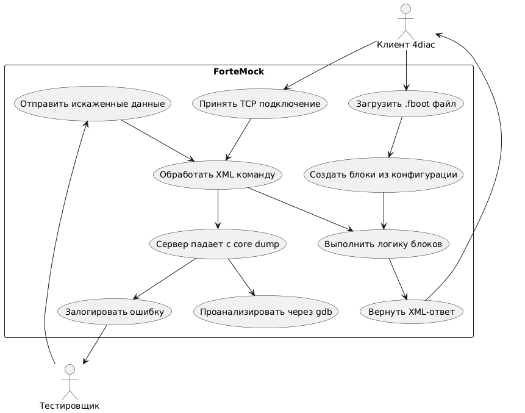

# ПМИ
## 1. Объект испытаний
- Программа-сервер среды исполнения IEC 61499 (аналог FORTE)
- TCP-сервер на порту 61499 для приема команд от 4diac

## 2. Цель испытаний
- 2.1 Проверить работоспособность TCP-сервера
- 2.2 Проверить обработку XML-команд формата 4diac
- 2.3 Проверить загрузку конфигурации из .fboot файлов
- 2.4 Проверить устойчивость к ошибочным данным

## 3. Требования к программе
- 3.1 Запуск TCP-сервера на порту 61499
- 3.2 Обработка XML-команд: CREATE, WRITE, START, QUERY
- 3.3 Поддержка функциональных блоков
- 3.4 Загрузка конфигурации из .fboot файлов при запуске
- 3.5 Реакция на специальные тестовые команды

## 4. Требования к программной документации
- 4.1 Техническое задание (Technical specification.md)
- 4.2 Исходный код с комментариями
- 4.3 Программа и методика испытаний (этот документ)

## 5. Состав и порядок испытаний

* **5.1 Функциональные испытания**
- Запуск сервера в режиме ожидания TCP-подключений
- Подключение клиента (telnet) к серверу
- Передача корректной XML-команды CREATE
- Контроль реакции сервера (XML-ответ OK)
- Тестирование загрузки .fboot файлов

* **5.2 Фаззинг-тестирование**
- Запуск тестового клиента (test_client.py) или zzuf для отправки искаженных данных
- Мониторинг работы сервера под нагрузкой
- Фиксация сбоев и аварийных завершений

## 6. Методы испытаний
- Функциональное тестирование — передача корректных команд в сервер и анализ ответов
- Фаззинг-тестирование — искажение входных данных с использованием test_client.py или zzuf

## Use-case диаграмма тестирования

{ width=80% }

